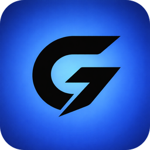
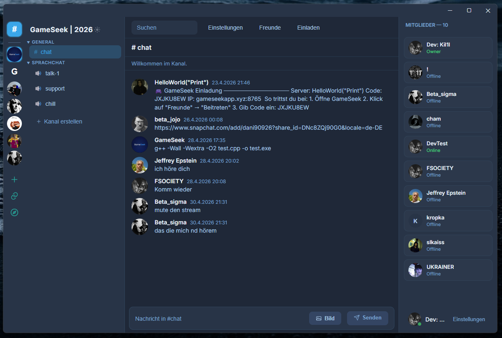
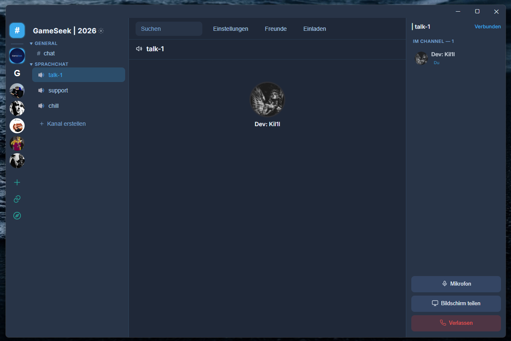
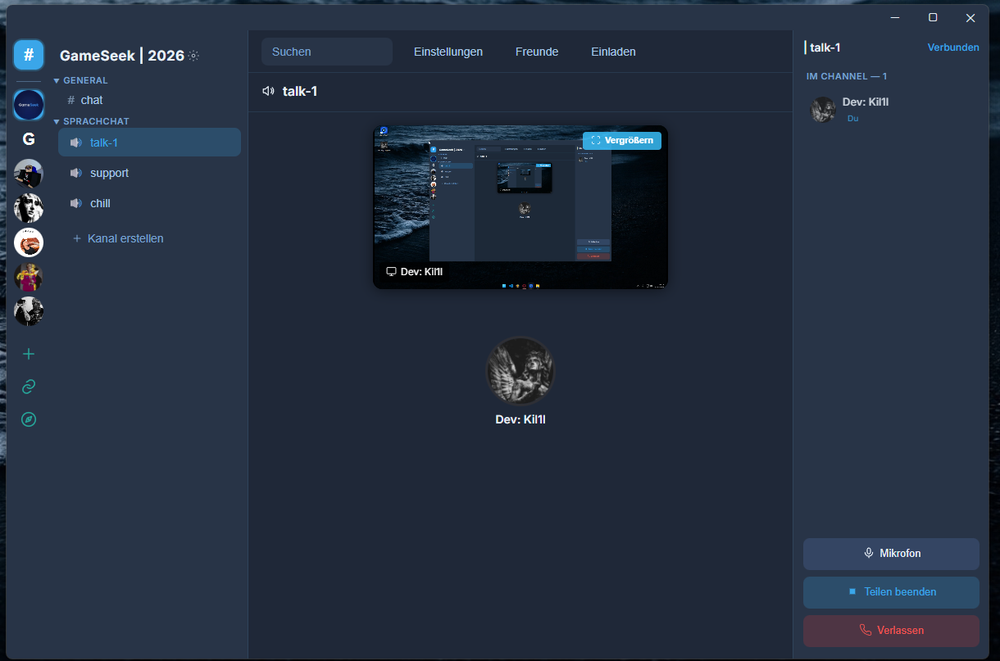
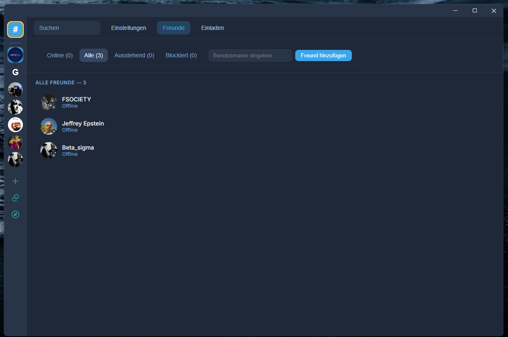

  

<h1 align="center">GameSeek</h1>

  A free, open communication platform for gamers. 
  Chat, voice, and screen sharing, built to stay lightweight.

  
  
  
  

This repository is the public home of GameSeek: what the product is, how it looks, how it is built, and how to take part. The app itself runs at [gameseekapp.com](https://gameseekapp.com).

## New here?

1. Open [gameseekapp.com](https://gameseekapp.com).
2. Create an account. Registration uses a 6-digit email code.
3. Join a server with an invite, or create your own.

The full walkthrough is in [Getting started](docs/getting-started.md). The interface in the screenshots below is still German. An English localization of the app is in progress.

## Preview

| Text channel | Voice channel |
| --- | --- |
|  |  |

| Screen sharing | Friends |
| --- | --- |
|  |  |

More screens are in [Features](docs/features.md).

## Why people try it

| | GameSeek | Discord |
| --- | --- | --- |
| Free | Yes | Yes |
| Voice and screen sharing | Yes | Yes |
| Open development | Yes | No |
| Built to stay lightweight | Yes | No |

## What you can do

- Real-time text chat, including edit and delete
- Voice channels with noise suppression and a speaking indicator
- Screen sharing in a multi-stream layout
- Servers, channel categories, roles, and permissions
- Ban and kick tools for server moderators
- Friends, profiles, and desktop notifications
- Web app and a native Windows app

## Download

| Platform | Where |
| --- | --- |
| Web | [gameseekapp.com](https://gameseekapp.com) |
| Windows | [gameseekapp.com](https://gameseekapp.com) |

GameSeek is in early access. Expect rough edges, and send feedback through [support](https://gameseekapp.com/support/index.html).

## Documentation

| | |
| --- | --- |
| **Start** | [Getting started](docs/getting-started.md) · [Features](docs/features.md) · [Roadmap](docs/roadmap.md) · [Changelog](CHANGELOG.md) |
| **Project** | [About](docs/about.md) · [How it is built](docs/build.md) · [Brand](docs/brand.md) · [Team](docs/team.md) |
| **Technical** | [Architecture](docs/architecture.md) · [API](docs/api.md) · [Deployment](docs/deployment.md) · [Changelog guide](docs/changelog-guide.md) |
| **Trust** | [Security](SECURITY.md) · [Community rules](CODE_OF_CONDUCT.md) · [Contributing](CONTRIBUTING.md) · [Legal notice](docs/legal/impressum.md) |

The full index is [docs/README.md](docs/README.md).

## Tech stack

| Layer | Technology |
| --- | --- |
| Desktop | Electron |
| App frontend | React, TypeScript |
| Website | HTML, CSS, JavaScript |
| Backend | Python (WebSockets and HTTP) |
| Real-time media | WebRTC |
| Database | SQLite |
| Hosting | Debian, Nginx, Let's Encrypt |

Details are in [Architecture](docs/architecture.md) and [How it is built](docs/build.md).

## On the roadmap

- English localization of the app
- Website login and API integration
- Matchmaking
- Custom invite links
- Mobile apps, video calls, bots, and direct messages

See the [roadmap](docs/roadmap.md) for what is done, in progress, and planned.

## Community

- Website: [gameseekapp.com](https://gameseekapp.com)
- Support: [support form](https://gameseekapp.com/support/index.html) · support@gameseekapp.com
- TikTok: [@gameseekoffizel](https://www.tiktok.com/@gameseekoffizel)
- Join the team: [open roles](docs/team.md) · jobs@gameseekapp.com

Please read the [community rules](CODE_OF_CONDUCT.md) before you take part.

## License

GameSeek is released under the [MIT License](LICENSE).
