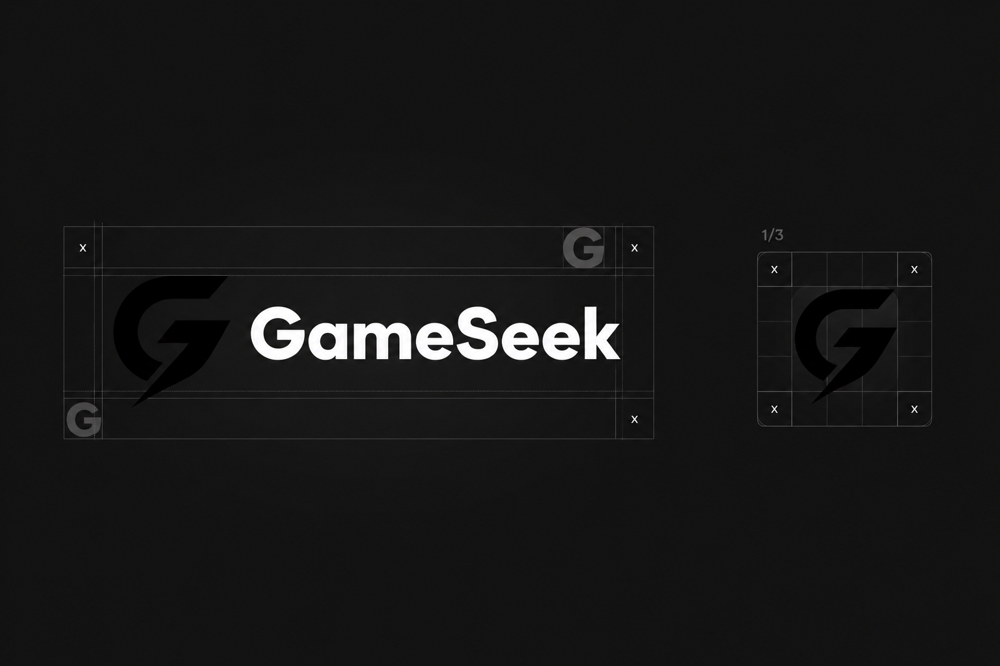

# Brand

GameSeek is a communication platform for gamers, aimed at people who want a simpler alternative to heavier chat apps. The product should stay fast, private, and visually quiet, and it should keep improving.

The public brand page is [gameseekapp.com/brand](https://gameseekapp.com/brand/index.html).

## Marks

| App icon | Wordmark and icon grid |
| --- | --- |
|  |  |

The line mark below is the same G drawn as a thin outline on a black field. Use the app icon or the wordmark when the mark needs to stay visible.

## The logo

The mark is a stylized **G**.

- The forward point stands for search and forward motion, the "seek" in the name.
- The layered strokes suggest depth, like moving through a digital space.
- The dark, minimal treatment keeps the identity modern.
- The circular stroke stands for a community that connects back to itself.

## Using the name

Write the product name as **GameSeek**, with a capital G and a capital S. Do not split it, hyphenate it, or restyle the casing in titles.

## Direction

The brand should stay:

- Fast in how the product feels
- Private in how it treats people
- Minimal in layout and color
- Current, because the product changes often

Planned product ideas that should stay visually consistent with this identity: custom servers, stronger moderation tools, a lightweight client, and features aimed at developers.

This repository is the public project home while the product is in development. The code license is [MIT](../LICENSE).

[Documentation index](README.md) · [Getting started](getting-started.md)
