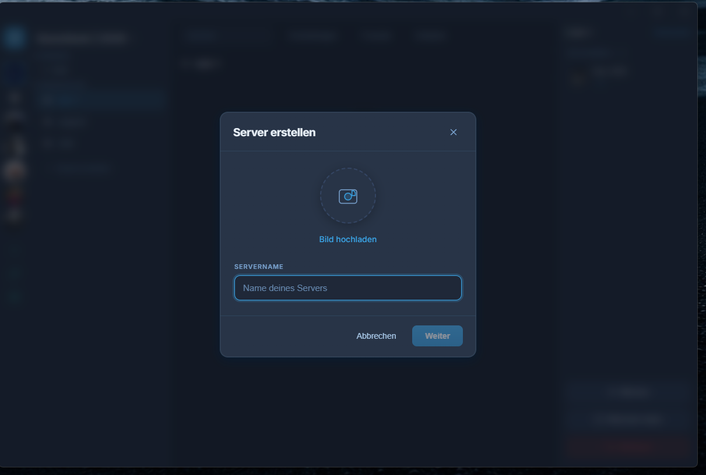
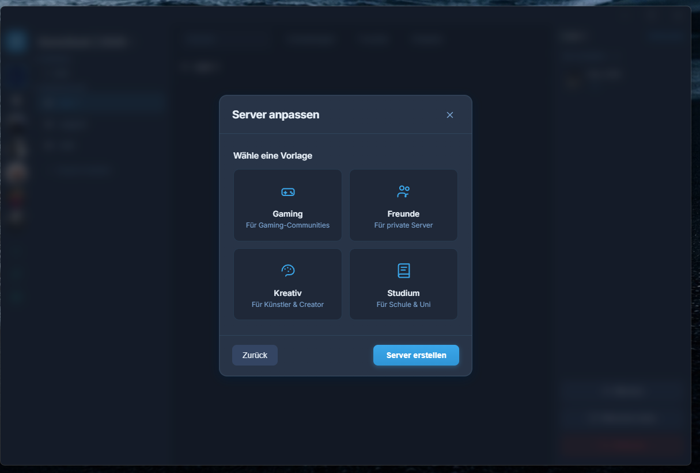
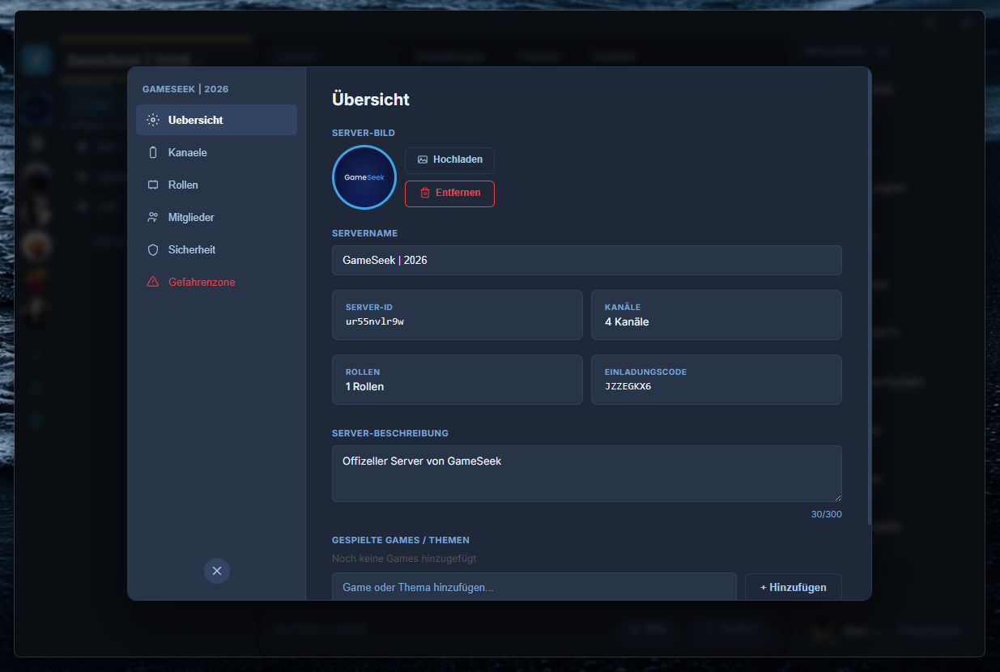
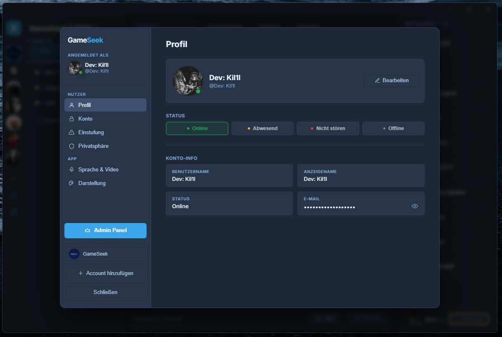
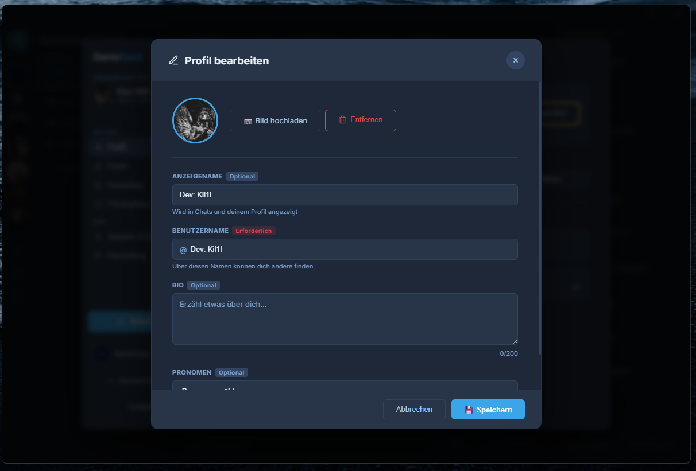

# Features

Everything you can do in GameSeek today. Open [gameseekapp.com](https://gameseekapp.com) and try it with your group. The shots below are the desktop app. Labels are still German. English localization is on the [roadmap](roadmap.md).

## Voice and screen sharing

This is the part you leave open while you play.

- Voice channels with peer-to-peer WebRTC audio
- Background noise suppression
- A speaking indicator that does not flicker
- Screen sharing, including more than one stream in a grid
- Renegotiation when streams change mid-call

| Voice | Screen share |
| --- | --- |
|  |  |

## Your server

A server is the home for your group. Spin one up, pick a vibe, then grow it.

- Create a server and choose a template: Gaming, Friends, Creative, or School
- Text channels, voice channels, and categories
- Roles and permissions
- Member management, including ban and kick with a reason
- Server security settings
- Danger zone: delete the server or transfer ownership
- A public server list for discovery

| Create | Template |
| --- | --- |
|  |  |

## Messaging

- Real-time text chat over WebSocket
- Edit and delete from the message context menu
- Edits and deletes broadcast live to everyone in the channel
- The view follows the latest message

## Friends and profiles

Find people by username, send a request, and show up the way you want.

- Friend requests, and lists for online, all, pending, and blocked
- Display name, username, bio, pronouns, and profile picture
- Status: online, idle, do not disturb, offline

| Profile | Edit |
| --- | --- |
|  |  |

## Desktop and web

| | Windows app | Web app |
| --- | --- | --- |
| Client | Electron | Browser |
| Connection | Direct `ws://` to the backend | `wss://` through Nginx |
| Notifications | Native Windows notifications | Browser notifications where supported |
| Features | Same product surface as the web app | Same product surface as the desktop app |

The client detects Electron at runtime and picks the matching connection.

## Accounts

- Registration with a 6-digit email code
- Login with an email verification code
- Profile management
- Account switching

## Support and admin

- Support tickets from the website, each with a `GS-XXXXXXXX` ID
- Email delivery through SendGrid
- Support pages in German and English
- An admin dashboard for platform management and moderation

## Where this is going

The [roadmap](roadmap.md) is what comes next. The [changelog](../CHANGELOG.md) is what already shipped.

Ready to try it? [Open GameSeek](https://gameseekapp.com).
